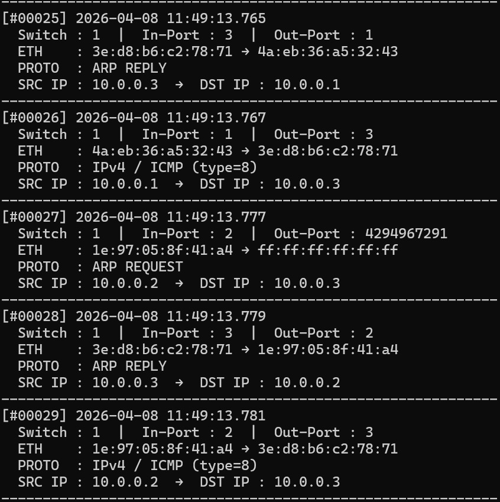
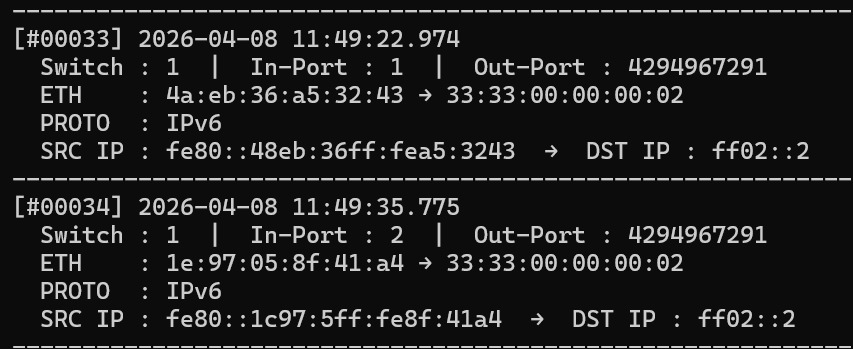

# SDN Packet Logger

A Software-Defined Networking (SDN) project that captures, logs, and displays packet header information in real time using a **Ryu SDN Controller** and a **Mininet** virtual network topology.

---

## Overview

This project implements a learning-switch SDN controller that:
- Intercepts every packet flowing through an OpenFlow-enabled switch
- Parses and identifies protocol types (ARP, ICMP, TCP, UDP, IPv6)
- Logs packet details to both the terminal and a persistent log file (`packet_log.txt`)
- Installs flow rules dynamically as it learns MAC-to-port mappings

---

## Project Structure

```
.
├── packet_logger.py   # Ryu SDN controller — packet capture & logging
├── topology.py        # Mininet topology — 3 hosts, 1 switch
└── packet_log.txt     # Auto-generated log file (created at runtime)
```

---

## Network Topology

```
  h1 (10.0.0.1)
        \
         s1 ── h2 (10.0.0.2)
        /
  h3 (10.0.0.3)
```

| Node | Type   | IP Address  |
|------|--------|-------------|
| h1   | Host   | 10.0.0.1/24 |
| h2   | Host   | 10.0.0.2/24 |
| h3   | Host   | 10.0.0.3/24 |
| s1   | Switch | —           |
| c0   | Controller (Ryu) | 127.0.0.1:6633 |

---

## Requirements

- Python 3.x
- [Ryu SDN Framework](https://ryu.readthedocs.io/)
- [Mininet](http://mininet.org/)
- Open vSwitch (OVS)

Install dependencies:

```bash
pip install ryu
sudo apt-get install mininet openvswitch-switch
```

---

## Running the Project

### Step 1 — Start the Ryu Controller

In **Terminal 1**, launch the packet logger controller:

```bash
ryu-manager packet_logger.py
```

You should see:
```
============================================================
  Packet Logger SDN Controller Started
============================================================
```

### Step 2 — Start the Mininet Topology

In **Terminal 2** (with `sudo`), start the topology:

```bash
sudo python3 topology.py
```

This will start the virtual network and drop you into the Mininet CLI.

---

## Testing the Network

Once the Mininet CLI is running, try the following commands:

| Command | Description |
|---|---|
| `pingall` | Test connectivity between all hosts |
| `h1 ping h2` | Ping from h1 to h2 |
| `h1 ping -c 5 h3` | Send 5 ICMP packets from h1 to h3 |
| `iperf h1 h2` | Measure bandwidth between h1 and h2 |
| `h1 curl http://10.0.0.2` | Generate TCP traffic |
| `dpctl dump-flows` | Inspect the switch's flow table |

---

## Log Output

All captured packets are logged to `packet_log.txt` and printed to the terminal.

### Sample Output Screenshots

**ARP handshake + ICMP ping sequence (packets #00025–#00029):**



**IPv6 Neighbor Discovery multicast packets (packets #00033–#00034):**



### Sample Log Entries

```
[#00025] 2026-04-08 11:49:13.765
  Switch : 1  |  In-Port : 3  |  Out-Port : 1
  ETH    : 3e:d8:b6:c2:78:71 → 4a:eb:36:a5:32:43
  PROTO  : ARP REPLY
  SRC IP : 10.0.0.3  →  DST IP : 10.0.0.1
------------------------------------------------------------
[#00026] 2026-04-08 11:49:13.767
  Switch : 1  |  In-Port : 1  |  Out-Port : 3
  ETH    : 4a:eb:36:a5:32:43 → 3e:d8:b6:c2:78:71
  PROTO  : IPv4 / ICMP (type=8)
  SRC IP : 10.0.0.1  →  DST IP : 10.0.0.3
------------------------------------------------------------
```

### Log Field Reference

| Field | Description |
|---|---|
| `[#NNNNN]` | Sequential packet counter |
| `Switch` | Datapath ID of the switch that saw the packet |
| `In-Port` | Switch port the packet arrived on |
| `Out-Port` | Switch port the packet was forwarded to (`4294967291` = FLOOD) |
| `ETH` | Source MAC → Destination MAC |
| `PROTO` | Parsed protocol (ARP REQUEST/REPLY, ICMP, TCP, UDP, IPv6) |
| `SRC IP → DST IP` | Layer-3 source and destination addresses |

> **Note:** `Out-Port: 4294967291` indicates a **flood** — the controller has not yet learned which port the destination is on, so the packet is sent out all ports.

---

## How It Works

### MAC Learning (Learning Switch)

1. When a packet arrives, the controller records `src_mac → in_port` in its MAC table.
2. It looks up `dst_mac` to find the output port.
3. If found, a **flow rule** is installed on the switch (idle timeout: 30s) so future matching packets are forwarded directly without hitting the controller.
4. If not found, the packet is **flooded** to all ports.

### Protocol Detection

The controller parses the following protocol stack:

```
Ethernet
 ├── ARP          → REQUEST or REPLY, with src/dst IP
 ├── IPv4
 │    ├── ICMP    → type field extracted
 │    ├── TCP     → src/dst ports + TCP flags
 │    └── UDP     → src/dst ports
 └── IPv6         → src/dst IPv6 addresses
```

---

## Notes

- The controller uses **OpenFlow 1.3** (`ofproto_v1_3`).
- A **table-miss flow entry** is installed at startup (priority 0) to send all unmatched packets to the controller, ensuring nothing is silently dropped before the MAC table is populated.
- IPv6 link-local multicast packets (e.g., `ff02::2`) will appear in the log as protocol `IPv6` — these are normal Neighbor Discovery messages generated by the hosts.
